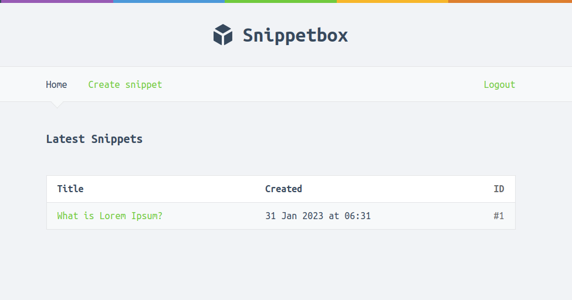

# Snippetbox

Snippetbox is a simple way to share snippets and pastes of code with others. It allows users to create and share single files, parts of files, or full applications.
This application is a part from the book `Let's Go` by `Alex Edwards` with some my personal improvements and deployed to Flyctl and FreeMySQLDatabase.



# How to run

- You need to have docker-compose

```bash
# Start containers
docker-compose up

# Start and force rebuild containers
docker-compose up --build

# Stop containers
docker-compose down

# Stop containers, delete volumes, and orphans
docker-compose down -v --remove-orphans
```

- Navigate to `https://localhost:8080` to see the application
